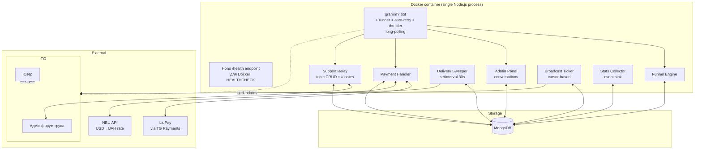

# Alyona Kavka Career Bot — Design Spec

**Дата:** 2026-05-16
**Автор:** ly
**Статус:** Draft → очікує review
**Реферeнс:** `/Users/ly/Downloads/Telegram Desktop/Карта с фигурными скобками.pdf` (a.k.a. `skkk.pdf`), `/Users/ly/Downloads/bot_prototype.html`

---

## 1. Огляд

Telegram-бот для Альони Кавки (HR-консультант з 18+ роками досвіду) — це лід-воронка, що сегментує користувачів, доносить продуктову лінійку (онлайн-уроки, консультації, "системний шлях до роботи"), приймає оплату через Telegram Payments (провайдер LiqPay), доставляє відео-уроки із захистом від копіювання та забезпечує комунікацію між юзерами і командою через форум-групу як CRM.

**Цільові показники:**
- Production-ready з першого релізу (без MVP-фази)
- Витримує 100k+ активних користувачів без архітектурних змін
- Адмін (Альона) самостійно редагує контент, веде розсилки і бачить статистику без розробника
- Час доставки уроків після оплати ≤ 5 секунд

---

## 2. Принципи дизайну

1. **Контент воронки = PDF 1:1.** Тексти, формулювання, ціни, emoji з reference-PDF копіюються дослівно. Стиль Альони поширюється тільки на місця, де PDF мовчить (доставка, error UX, /help). Ці "нові ділянки" зібрані в `seed/system-messages.ts` і явно позначені для перегляду замовником.
2. **Telegram як control plane.** Адмін все робить через TG (in-bot панель + форум-група як CRM). Без вебу.
3. **Стейтлес у логіці, persistent у даних.** Один процес — рестартний у будь-який момент без втрати стану.
4. **Ідемпотентна доставка.** Платіж → контент гарантовано доставляється, навіть якщо процес помер посеред операції.
5. **Розумна простота.** Без Redis, без черг, без воркерів-процесів. Те, що можна зробити cursor-based — робимо cursor-based.
6. **Кожна одиниця коду має одне призначення.** Малі файли, явні границі, типи на кордонах.

---

## 3. Архітектура



**Один процес, один Docker-image.** Усі під-системи живуть у тому самому Node.js рантаймі, спілкуються через спільну MongoDB. Це обмежує нас одним екземпляром бота (для long-polling/webhook у TG може бути тільки один активний), але дає простоту деплою та обслуговування.

---

## 4. Tech Stack (станом на 2026-05, перевірено через npm registry)

| Шар | Інструмент | Версія | Чому |
|-----|-----------|--------|------|
| Runtime | **Node.js 24 LTS** | 24.x | Active LTS до 2026-10, потім Maintenance до 2028-04 |
| Мова | **TypeScript 6 strict + `noUncheckedIndexedAccess`** | ^6.0 | Тип-safe, ловить null/undefined на компіляції |
| Bot framework | **grammY** core + плагіни | grammy ^1.43, conversations ^2.1, runner ^2.0, auto-retry ^2.0, menu ^1.3, transformer-throttler ^1.2, storage-mongodb ^2.5, files ^1.2 | Type-safe, production-ready, активний community |
| HTTP (тільки health) | **Hono** + `@hono/node-server` | ^4.12, ^2.0 | Мінімальний health-endpoint для Docker HEALTHCHECK; webhook не використовуємо (TG long-poll справляється) |
| DB driver | **MongoDB native driver** | ^7.2 | Без Mongoose magic, прямий контроль |
| Валідація | **Zod 4 Classic** | ^4.4 | Один тул для env, runtime input, DB schemas |
| Логи | **pino** + **pino-pretty** | ^10.3, ^13.1 | JSON-логи з PII redact, швидкість |
| Errors | **@sentry/node** | ^10.5 | Прод-моніторинг, OpenTelemetry 2.x |
| Міграції | **migrate-mongo** | ^14.0 | Версіонування схем |
| Білд | **tsup** | ^8.5 | Single-bundle, швидко |
| Тести | **Vitest** + **@testcontainers/mongodb** | ^4.1, ^11.14 | Unit + integration |
| Lint/Format | **Biome 2** | ^2.4 | Швидше за ESLint+Prettier, один тул |
| HTTP-клієнт | **undici** | ^8.3 | Швидкі fetch-style запити (NBU API) |
| Crypto | **libsodium-wrappers** | ^0.8 | Шифрування secrets у settings |
| CI | **GitHub Actions** | — | Безкоштовно для приватних репозиторіїв з лімітом |
| Деплой | **Docker multi-stage (distroless final)** + docker-compose | — | Малий image (~70MB), нема shell у проді |
| Деплой-режим | **Long-polling через @grammyjs/runner** | — | Без публічного домену/SSL, простота; одна інстанція бота |

**Чому не Mongoose:** історія middleware-багів у production, magic у hooks/virtuals що погано взаємодіє з async generators (`conversations`). Прямий driver + Zod дає кращу type-safety.

**Чому не Redis:** на старті не потрібен. Sessions і conversations зберігаємо в MongoDB через `@grammyjs/storage-mongodb`. Розсилка — cursor-based по `users`, без черги. Якщо виростимо > 100k активних — додамо.

---

## 5. Модель даних (MongoDB)

### Колекції

#### `users`
```typescript
{
  _id: ObjectId,
  tg_id: number,           // unique index
  username?: string,
  first_name: string,
  last_name?: string,
  language_code: string,
  segment?: 'first_job' | 'growing' | null,
  current_node_id?: string,  // де зараз у воронці
  funnel_paused: boolean,    // /pause
  blocked: boolean,           // юзер заблокував бота
  is_admin: boolean,
  permissions: {
    manage_admins: boolean,      // додавати/видаляти адмінів, керувати їх правами
    edit_content: boolean,       // редагувати ноди воронки
    manage_products: boolean,    // CRUD продуктів і уроків
    broadcast: boolean,          // створювати і запускати розсилки
    view_stats: boolean,         // переглядати статистику і журнал
    support: boolean,            // відповідати юзерам у топіках
    manage_settings: boolean,    // налаштування (курс, group chat, secrets)
    refund: boolean,             // позначати покупки як refunded
  },
  created_at: Date,
  last_seen_at: Date,
  // деноморм. метрики для швидких запитів:
  purchases_count: number,
  total_spent_uah: number,
  // GDPR:
  deleted_at?: Date,         // soft-delete
}
```

#### `flow_nodes`
```typescript
{
  _id: ObjectId,
  node_id: string,            // human-readable, unique: 'welcome', 'segment_pick', ...
  segment?: 'first_job' | 'growing' | null,
  chunks: Array<{
    type: 'text' | 'photo' | 'video_note' | 'media_group' | 'typing_pause',
    content: string,          // текст або caption або file_id
    file_id?: string,
    delay_before_ms: number,  // typing-пауза перед відправкою
  }>,
  buttons: Array<{
    label: string,
    action: 'goto_node' | 'open_product' | 'buy' | 'open_url' | 'support',
    payload: string,           // node_id / product_id / url / null
    row: number,               // для grid-розкладки
  }>,
  updated_at: Date,
  updated_by_tg_id?: number,
}
```

#### `products`
```typescript
{
  _id: ObjectId,
  product_id: string,         // 'base_6', 'lesson_resume', 'consult_career', ...
  type: 'digital' | 'appointment',
  title: string,
  description: string,
  price: number,              // у валюті currency
  currency: 'UAH' | 'USD',
  visible: boolean,
  lessons?: string[],         // product_id → lesson_ids (для digital)
  order: number,
  created_at: Date,
}
```

#### `lessons`
```typescript
{
  _id: ObjectId,
  lesson_id: string,
  product_ids: string[],      // в яких продуктах присутній (база + може бути в окремому)
  title: string,              // "Урок 1: Як почати пошук роботи"
  caption?: string,
  video_file_id: string,      // TG file_id, готовий для пересилки
  duration_sec?: number,
  size_bytes?: number,
  order_in_product: Record<string, number>,  // product_id → порядок
  uploaded_at: Date,
  uploaded_by_tg_id: number,
}
```

#### `purchases`
```typescript
{
  _id: ObjectId,
  user_tg_id: number,
  product_id: string,
  amount_uah: number,         // фактично оплачено
  amount_original: number,
  currency_original: 'UAH' | 'USD',
  exchange_rate_used?: number,
  provider_payment_id: string,  // unique index
  telegram_payment_charge_id: string,
  status: 'paid_pending_delivery' | 'delivered' | 'failed_delivery',
  delivery_attempts: number,
  created_at: Date,
  delivered_at?: Date,
}
```

#### `appointments`
```typescript
{
  _id: ObjectId,
  user_tg_id: number,
  product_id: string,
  purchase_id: ObjectId,
  status: 'new' | 'contacted' | 'scheduled' | 'completed' | 'cancelled',
  scheduled_at?: Date,
  admin_notes: string[],      // internal-only нотатки команди
  created_at: Date,
}
```

#### `support_topics`
```typescript
{
  _id: ObjectId,
  user_tg_id: number,         // unique index
  chat_id: number,            // адмін-група
  thread_id: number,          // forum topic id
  pinned_card_message_id: number,  // ID закріпленого повідомлення-картки
  created_at: Date,
  flood_until?: Date,         // anti-spam mute
}
```

#### `broadcasts`
```typescript
{
  _id: ObjectId,
  segment_filter: SegmentFilter,
  source_message: {            // що шлемо
    type: 'text' | 'photo' | 'video' | 'voice' | 'document',
    text?: string,
    file_id?: string,
    caption?: string,
    parse_mode?: 'HTML' | 'MarkdownV2',
  },
  status: 'draft' | 'running' | 'paused' | 'done' | 'cancelled',
  total_target: number,
  sent_count: number,
  failed_count: number,
  last_processed_user_id?: ObjectId,   // cursor
  created_by_tg_id: number,
  created_at: Date,
  started_at?: Date,
  finished_at?: Date,
}
```

#### `events`
```typescript
{
  _id: ObjectId,
  user_tg_id: number,
  type: 'funnel_step' | 'product_view' | 'invoice_sent' | 'payment_success' | 'lesson_delivered' | 'support_message' | ...,
  payload: Record<string, unknown>,
  at: Date,
}
```
Індекси: `{ at: -1 }`, `{ user_tg_id, at: -1 }`, `{ type, at: -1 }`.

#### `settings` (singleton)
```typescript
{
  _id: 'singleton',
  admin_group_chat_id?: number,
  admins_tg_ids: number[],
  liqpay_provider_token: string,    // зашифрований (sodium)
  liqpay_test_mode: boolean,
  exchange_rate_uah_per_usd: number,
  exchange_rate_updated_at: Date,
  exchange_rate_manual_override?: number,
  privacy_policy_url: string,
  professions_channel_url: string,
}
```

#### `admin_sessions`
Зберігання `conversations` стану (через `@grammyjs/storage-mongodb`). Керується ним же.

---

## 6. Воронка і контент

### Структурний кістяк (зашитий у код)

```mermaid
graph LR
    START[/start] --> WELCOME[welcome<br/>знайомство]
    WELCOME --> SEG{Сегментація:<br/>Хто ти зараз?}
    SEG --> FIRST[👶 Перша робота]
    SEG --> GROW[💼 Вже працюю]

    FIRST --> F_INTRO[вступ: 4 етапи]
    F_INTRO --> F_CASE[кейс юриста]
    F_CASE --> F_OFFER[продуктова лінійка]
    F_OFFER --> F_PICK{З чим складність?}
    F_PICK --> P_BASE[База 6 уроків]
    F_PICK --> P_LESSONS[Окремі уроки]
    F_PICK --> P_PROF[Профорієнтація]
    F_PICK --> P_CAREER[Кар'єрна]
    F_PICK --> P_SYSTEM[Системний шлях]

    GROW --> G_INTRO[вступ: ріст це система]
    G_INTRO --> G_Q1[Тест 1/3] --> G_Q2[Тест 2/3] --> G_Q3[Тест 3/3]
    G_Q3 --> G_UNIVERSAL[універсальна відповідь]
    G_UNIVERSAL --> G_CASE[кейс із-за кордону]
    G_CASE --> F_OFFER

    P_LESSONS --> L_PICK{Який урок?}
    L_PICK -.6 уроків.-> L_BUY[урок · 200 ₴]

    P_BASE --> BASE_BUY[💳 База 960 ₴]
    P_PROF --> PROF_BUY[💳 1000 ₴]
    P_CAREER --> CAREER_BUY[💳 2000 ₴]
    P_SYSTEM --> SYSTEM_BUY[💳 $150]

    BASE_BUY --> DELIVERY[доставка 6 уроків]
    L_BUY --> DELIVERY_1[доставка 1 уроку]
    PROF_BUY & CAREER_BUY & SYSTEM_BUY --> BOOKING[заявка в адмін-топік]

    F_OFFER -.не натиснув.-> LIB[📚 Бібліотека професій<br/>лінк на TG-канал]
```

### Список нод (попередній, перед seeding-ом)

| node_id | Сегмент | Опис |
|---------|---------|------|
| `welcome` | — | Привітальне повідомлення (з PDF) |
| `intro_alyona` | — | "Я — Альона Кавка..." (з PDF) |
| `segment_pick` | — | "Хто ти зараз?" + 2 кнопки |
| `seg_first_job_intro` | first_job | "перша робота — це завжди про купу питань..." |
| `seg_first_job_case` | first_job | Кейс студента-юриста |
| `seg_first_job_offer` | first_job | Продуктова лінійка (5 форматів) |
| `seg_first_job_pick` | first_job | "З чим у тебе найбільша складність?" + 5 кнопок |
| `prod_base` | — | "База (6 уроків)" опис + кнопка купити |
| `prod_lessons_pick` | — | "Який урок?" + 6 кнопок |
| `prod_lesson_search` | — | Урок "Пошук роботи" |
| `prod_lesson_resume` | — | Урок "Резюме" |
| `prod_lesson_linkedin` | — | Урок "LinkedIn" |
| `prod_lesson_interview` | — | Урок "Співбесіди" |
| `prod_lesson_hard_qs` | — | Урок "Складні питання" |
| `prod_lesson_salary` | — | Урок "Зарплата" |
| `prod_profession` | — | Профорієнтація опис + запис |
| `prod_career` | — | Кар'єрна консультація опис + запис |
| `prod_system_path` | — | Системний шлях опис + запис |
| `seg_growing_intro` | growing | "Твої ключові питання зараз..." |
| `seg_growing_q1` | growing | Тест 1: що стопорить? |
| `seg_growing_q2` | growing | Тест 2: що пробував? |
| `seg_growing_q3` | growing | Тест 3: що важливіше? |
| `seg_growing_universal` | growing | Універсальна відповідь |
| `seg_growing_case` | growing | Кейс жінки з-за кордону |
| `seg_growing_offer` | growing | Продуктова лінійка |
| `fallback_library` | — | "Бібліотека професій" канал |

**Повний extracted text PDF (для seed) → `docs/reference/funnel-content.md`** (буде створено окремо перед імплементацією).

### Редагування (Medium)

- Адмін через `/admin → 📝 Контент` редагує `chunks` і `buttons.label` будь-якої ноди.
- Адмін **не може** видаляти ноди чи переставляти ребра (структура зашита).
- Можна додавати/видаляти **окремі уроки** і **окремі продукти** (через `/admin → 🎓 Продукти`).

---

## 7. Продукти і ціни

| product_id | Тип | Назва | Ціна | Валюта |
|-----------|-----|-------|------|--------|
| `base_6` | digital | База (6 уроків) | 960 | UAH |
| `lesson_search` | digital | Урок: Пошук роботи | 200 | UAH |
| `lesson_resume` | digital | Урок: Резюме | 200 | UAH |
| `lesson_linkedin` | digital | Урок: LinkedIn | 200 | UAH |
| `lesson_interview` | digital | Урок: Співбесіди | 200 | UAH |
| `lesson_hard_qs` | digital | Урок: Складні питання | 200 | UAH |
| `lesson_salary` | digital | Урок: Зарплата | 200 | UAH |
| `consult_profession` | appointment | Профорієнтація | 1000 | UAH |
| `consult_career` | appointment | Кар'єрна консультація | 2000 | UAH |
| `system_path` | appointment | Системний шлях до роботи | 150 | USD |

### Конвертація USD → UAH

- При інвойсі для USD-продукту бот рахує `amount_uah = ceil(price_usd * rate)`.
- `rate` береться з `settings.exchange_rate_manual_override` (якщо встановлено) або `settings.exchange_rate_uah_per_usd` (NBU API оновлюється раз на добу о 09:00 Києва).
- В TG-invoice показуємо: `Системний шлях до роботи — 6 200 ₴ (≈ $150)`.
- У базі зберігаємо обидва: `amount_uah`, `amount_original=150`, `currency_original='USD'`, `exchange_rate_used=41.33`.

---

## 8. Доставка контенту

### Цикл життя `purchase`

```
1. payment_pre_checkout    → answer OK (ціни статичні)
2. successful_payment      → INSERT purchase { status: 'paid_pending_delivery', delivery_attempts: 0 }
                            → reply юзеру: "🎉 Дякую за покупку! Готую твої уроки..."
3. delivery sweeper        → кожні 30с шукає paid_pending_delivery
4. для кожного:
     - якщо digital: sendVideo(file_id, protect_content: true) для кожного уроку
                     з паузою 1.5с між уроками
     - якщо appointment: системне повідомлення в адмін-топік
                         + reply юзеру "Альона напише сюди протягом 24 год"
5. UPDATE status = 'delivered'
   delivery_attempts++
6. якщо delivery_attempts >= 5 і досі не вдалося → status = 'failed_delivery',
   alert адміну в його приватний чат
```

### Захист уроків

- Усі `sendVideo` для куплених уроків з `protect_content: true` → юзер не може форвардити, копіювати у "Saved Messages" чи переслати іншому.
- Доступ до уроків через `📚 Мої уроки` — **назавжди**. Перевідправка по file_id, миттєво.

### Завантаження уроку адміном

```
/admin → 🎓 Уроки → ➕ Новий урок
1. Назва     → ввід тексту
2. Caption   → ввід тексту (опційно)
3. Відео     → надішли mp4 (бот зберігає file_id)
4. Тривалість і розмір — автоматично з message.video
5. Прив'язка до продукту: вибір зі списку (multi-select)
6. Порядковий номер: ввід або auto = (max + 1)
7. Preview "Так юзер побачить:" → sendVideo назад адміну
8. [✅ Зберегти] [❌ Скасувати]
```

---

## 9. Платежі

### Telegram Payments через LiqPay

- `bot.api.sendInvoice(...)` з `provider_token` (LiqPay test/prod через env)
- `pre_checkout_query`: завжди `ok: true` (ціни фіксовані, перевіряти нема чого)
- `successful_payment`: тригер цикла доставки
- **Refund**: не автоматизуємо. Якщо треба повернути — через LiqPay-кабінет вручну, далі адмін позначає `purchases.status = 'refunded'` через `/admin`.

### Безпека

- `provider_token` зашифрований у `settings` (sodium secretbox з master-ключем у env)
- Усі платежні події логуються в `events` з типом `payment_*` для аудиту
- Дублі за `provider_payment_id` (unique index) — захист від повторного нарахування

---

## 10. Підтримка / CRM (форум-група)

### Setup

1. Адмін створює супергрупу в TG з увімкненими **Topics**, додає бота, дає права `manage_topics`.
2. Адмін у боті: `/init_admin_group` → пересилає будь-яке повідомлення з тієї групи в приватний чат з ботом. Бот витягує `chat.id`, записує в `settings.admin_group_chat_id`, перевіряє permissions, надсилає підтвердження.

### Створення топіка

- При **першій взаємодії** юзера з ботом → `createForumTopic({ name: "First Last (@username)" })`.
- Перше повідомлення в топіку — **картка профілю**, закріплюється (`pinChatMessage`):

```
👤 Олена Петренко
📱 @olena_p
🆔 123456789
📅 Старт: 16.05.2026 14:23
🌐 uk · UTC+2

──────────────
📊 Воронка
└─ Зараз на: "База 6 уроків"

💰 Купівлі
└─ ще немає
──────────────
```

Картка **автооновлюється** через `editMessageText` при кожному relevant event (новий крок воронки, покупка, заявка). `pinned_card_message_id` зберігається в `support_topics`.

### Юзер → команда

- Будь-яке **не-callback** повідомлення юзера (текст, фото, voice, video, document, sticker) → `copyMessage` у його топік **без `reply_to_message_id`**.
- Якщо це команда (`/start`, `/help`, ...) — НЕ копіюємо (це не "повідомлення для команди").

### Команда → юзер

- Адмін пише повідомлення в топіку → бот ловить через `message_thread_id` lookup → `copyMessage(user_chat_id, ...)`.
- **Internal note**: якщо повідомлення адміна **починається з `//`** → бот не пересилає юзеру. Просто залишається у топіку як нотатка команди.
- Якщо адмін відповів реплаєм на повідомлення юзера → теж пересилається з цитатою.

### Системні повідомлення в топіку

| Тип | Формат |
|-----|--------|
| 🟢 Покупка | `🟢 КУПІВЛЯ\n{product_title}\n{amount} ₴\n{datetime} · pay-id: {id}` |
| 🟠 Заявка | `🟠 ЗАЯВКА\n{product_title} · {amount} ₴\n❗ Потребує реакції — узгодити час` |
| 🔵 Воронка | `🔵 Дійшов до: {node_title}` (раз за крок, throttle 1 раз/година для одної ноди) |
| 🔴 Помилка | `🔴 Помилка доставки {what} — буде retry / потребує уваги` |

### Anti-spam

- Юзер шле > 10 повідомлень за хвилину → `flood_until = now + 10min`. Поки flood_until — бот ігнорує повідомлення юзера (нічого не копіює в топік, нічого не відповідає). У топіку одне повідомлення: `⚠️ Юзер у flood-mode до {time}`.

### Username зміни / видалені топіки

- Middleware виявляє зміну `username` → раз на добу `editForumTopic` (новий name).
- Якщо `copyMessage` повертає `Bad Request: TOPIC_DELETED` або `MESSAGE_THREAD_NOT_FOUND` → створюємо новий топік, оновлюємо `support_topics`.

---

## 11. Адмін-панель

### Доступ — гранулярні permissions

- Перший адмін (owner) задається через env `OWNER_TG_IDS` — отримує всі permissions автоматично при першому `/start`.
- Будь-яка адмін-дія перевіряє конкретний permission через middleware `requirePermission('edit_content')`. Без потрібного дозволу — бот відповідає: `Тут потрібен дозвіл "{name}". Звернись до Альони.`
- Список permissions:
  - `manage_admins` — керувати командою
  - `edit_content` — редагувати тексти/кнопки воронки
  - `manage_products` — CRUD продуктів і уроків
  - `broadcast` — створювати і запускати розсилки
  - `view_stats` — переглядати статистику і журнал
  - `support` — відповідати юзерам у топіках і отримувати сповіщення
  - `manage_settings` — налаштування (курс, group chat, LiqPay)
  - `refund` — позначати покупки як refunded

### Команда (Управління адмінами)

`/admin → ⚙️ Налаштування → 👥 Команда` (потребує `manage_admins`).

```
👥 Команда (5 учасників)

🟢 Альона Кавка (@alyona_k) · owner · 8/8
🟢 Петро Помічник (@petro) · 3/8
   ✓ support  ✓ view_stats  ✓ broadcast
🟢 Олена Підтримка (@olena_s) · 1/8
   ✓ support
🔴 Іван (@ivan_b) · вимкнено
   (без активних permissions)

[➕ Додати з контактів]
[✏️ Редагувати когось]
```

**Додавання:** кнопка `➕ Додати з контактів` показує reply-keyboard з `KeyboardButton.request_users` (multi-select, `users_shared` update). Юзер обирає 1+ людей з TG-контактів → бот отримує IDs і додає всіх з дефолтним permission `support: true`. Далі одразу екран редагування для кожного.

**Редагування permissions:** вибір адміна → inline-keyboard з checkboxes:
```
✏️ @petro

☑ manage_admins
☑ edit_content
☐ manage_products
☑ broadcast
☑ view_stats
☑ support
☐ manage_settings
☐ refund

[💾 Зберегти] [🗑 Видалити з команди]
[👈 Назад]
```

Тогл на checkbox → миттєвий save (без окремого "Зберегти"). Кнопка `🗑 Видалити` зануляє всі permissions і ставить `is_admin = false` (з підтвердженням).

**Owner-захист:** не можна видалити останнього з `manage_admins`. Не можна забрати у себе `manage_admins` якщо ти єдиний (інакше панель стане недосяжною).

### Audit log

Усі адмін-дії пишуться в `events` з `type='admin_action'` і `payload: { actor_tg_id, action, target?, diff? }`.

Журнал: `/admin → ⚙️ → 📜 Журнал` (потребує `view_stats`). Показує останні 50 дій з кнопкою "більше":
```
📜 Журнал

15:42 — @petro запустив розсилку (сегмент: всі, 2,341)
15:30 — @alyona_k відредагувала ноду "prod_base"
14:18 — @alyona_k додала адміна @olena_s
...
```

### Меню

```
👋 Альона, з чим попрацюємо?

[📝 Контент воронки]
[🎓 Продукти і уроки]
[📨 Розсилки]
[📊 Статистика]
[⚙️ Налаштування]
[🔍 Знайти юзера]
```

### Breadcrumbs

В першому рядку кожного екрана:
```
⚙️ Адмін → 🎓 Продукти → ✏️ База 6 уроків
```

Внизу:
```
[👈 Назад] [🏠 Головне]
[❌ Скасувати]
```

### Редагування ноди

```
1. Адмін: /admin → 📝 Контент → обирає сегмент → обирає ноду
2. Бот: показує preview (як юзер бачить)
3. Бот: [✏️ Замінити тексти] [🔘 Замінити кнопки] [🖼 Замінити медіа] [❌ Скасувати]
4. Адмін обирає що змінити → надсилає нову версію
5. Бот: "Ось так буде. Зберегти?" + preview
6. [✅ Зберегти] [❌ Скасувати]
7. Після save: лог у events ({ type: 'admin_edit_node' }), бот: "Готово, зміни вже в боті 🚀"
```

### Conversation safety

- Глобальний middleware: `/admin`, `/cancel`, `/start` ріжуть будь-яку поточну conversation.
- TTL conversation = 30 хв (`@grammyjs/conversations` cleanup).
- Кожен крок має inline-кнопку `❌ Скасувати`.

---

## 12. Розсилки

### Сегменти

- `all` — всі активні (`!blocked && !deleted_at`)
- `first_job` — `segment = 'first_job'`
- `growing` — `segment = 'growing'`
- `not_segmented` — без сегменту
- `bought_any` — `purchases_count > 0`
- `bought_base` — куплено `base_6`
- `bought_lesson` — куплено будь-який окремий урок
- `not_purchased` — `purchases_count = 0`
- `stuck_at_node:{node_id}` — `current_node_id = X` довше N днів (custom через UI)

### UX-flow створення

```
/admin → 📨 Розсилки → ➕ Нова

Крок 1/3 — Сегмент
  [👥 Всі активні · ~2,341]
  [👶 Перша робота · ~890]
  ...

Крок 2/3 — Повідомлення
  Бот: "Надішли мені повідомлення, яке треба розіслати."
  Адмін шле текст/фото/відео/voice.

Крок 3/3 — Підтвердження
  Бот: показує preview як юзер бачить
       📊 Отримувачів: 1,890
       ⏱ Орієнтовно: ~75 секунд
  [🚀 Запустити] [✏️ Змінити] [❌ Скасувати]
```

### Виконання

- Cursor-based: `users.find({...segment...}).sort({ _id: 1 }).batchSize(100)`
- Один тіcker (`setInterval` 1с): бере pending broadcast, шле наступний батч (20 повідомлень), оновлює `last_processed_user_id`.
- Rate-limit: max 25 msg/s через `@grammyjs/transformer-throttler` (global limit бота).
- Auto-retry для 429 через `@grammyjs/auto-retry`.
- Якщо `sendMessage` повертає `Forbidden: bot was blocked` → `users.blocked = true`, `failed_count++`, не зупиняємо broadcast.
- Прогрес у вікно адмін-меню кожні 2с (`editMessageText`).

### Контроль

- Адмін: `⏸ Призупинити` → `status = 'paused'`, тіcker пропускає.
- `▶️ Продовжити` → `status = 'running'`.
- `❌ Скасувати` → `status = 'cancelled'`, тіcker пропускає.

---

## 13. Статистика

### Швидкий екран

```
📊 Статистика (за 7 днів)

👥 Юзерів
├─ нових: 234
├─ активних: 1,120
└─ всього: 5,672

💰 Дохід: 18 720 ₴
├─ База 6 уроків: 12,480 ₴ (13 × 960)
├─ Окремі уроки: 4,400 ₴ (22 × 200)
└─ Консультації: 8,000 ₴ (4)

🎯 Конверсії
├─ /start → сегментація: 87%
├─ сегментація → продукт: 34%
└─ продукт → купівля: 12%

[📅 За місяць] [📅 За весь час]
[📊 По воронці] [📊 По продуктах]
```

### Деталі по воронці

Mongo aggregation pipeline: для кожної ключової ноди → кількість унікальних `events.user_tg_id` з `type='funnel_step'` і `payload.node_id=X`. Conversion-rate = nodeX_users / parent_users.

### Експорт

- `/admin → 📊 Статистика → 📤 Експорт CSV` → надсилає юзеру файл за період (purchases, users, events).

---

## 14. UX/UI принципи

### Tone of voice

- Тексти воронки = PDF 1:1 (включно з emoji, пунктуацією)
- Нові ділянки (доставка, /help, error) — в стилі Альони: коротко, "ти", emoji
- Всі нові ділянки — в `seed/system-messages.ts`, позначені `// TO BE APPROVED BY ALYONA`

### Ритм

- Кожна нода = серія chunks з паузами 1-2с
- Перед кожним chunk: `sendChatAction('typing')` + `setTimeout(delay_before_ms)`
- Емітимо `chat_action` ще раз після 5с якщо chunk довгий

### Reply keyboard (persistent)

```
┌──────────────┬──────────────┐
│  📚 Мої уроки │  💬 Підтримка│
└──────────────┴──────────────┘
```

Показується **усім юзерам** (навіть тим, хто ще не купив). При кліку на "📚 Мої уроки" без покупок:
```
У тебе ще немає куплених уроків ✨
Подивись, що в мене є — і обери, що відгукується ⬇
[🎯 Подивитись продукти]
```

### Команди (bot menu)

**Юзер:**
```
/start — почати спочатку
/lessons — мої уроки
/help — написати в підтримку
/about — про Альону
/pause — пауза автоматичних повідомлень
/resume — продовжити
/delete_my_data — видалити мої дані
```

**Адмін (додатково, видно тільки якщо `is_admin`):**
```
/admin — панель адміна
/stats — швидка статистика (потребує view_stats)
/broadcast — нова розсилка (потребує broadcast)
/find — знайти юзера (потребує support)
/init_admin_group — підключити форум-групу (потребує manage_settings)
```

Команди фільтруються через `setMyCommands` зі scope `chat` для кожного адміна окремо, щоб бачили тільки те, на що мають дозвіл.

### Bot identity

- `bot_description`: "Допомагаю знайти роботу мрії 💼"
- `bot_short_description`: "Кар'єрний бот Альони Кавки"
- Profile photo: фото Альони (закладемо в `assets/`)
- Privacy policy URL: посилання у `/start` (на лендінг)

---

## 15. Обробка помилок

### Класифікація

| Шар | Стратегія |
|-----|-----------|
| TG API 429 | auto-retry (через `@grammyjs/auto-retry`) |
| TG API 400 (bad request) | log + sentry, не повторювати |
| TG API 403 (blocked) | mark `users.blocked = true` |
| MongoDB connection | retry з exponential backoff, після 30с → процес exit (Docker restart) |
| Payment delivery failure | retry до 5 раз, потім alert адміну |
| LiqPay невалідна підпись | reject + log + sentry |
| Unknown errors | sentry + повідомлення юзеру "Щось пішло не так. Альона про це знає, ми розберемось." |

### User-facing

- **Помилка платежу:** "Не вдалося провести оплату 😔 Спробуй ще раз або напиши /help"
- **Помилка доставки уроку:** мовчазний retry. Якщо 5 спроб → alert в адмін-топік юзера: "🔴 Помилка доставки уроку 3 для {user} — потребує уваги"
- **Не знає що відповісти на текст:** не "я бот, не розумію". Замість цього: copy у форум-топік + тиха відповідь юзеру: "Передала твоє повідомлення Альоні — відповідь буде сьогодні-завтра 🙌"

---

## 16. Безпека і Privacy

### PII

- Зберігаємо: `tg_id`, `username`, `first_name`, `last_name`, `language_code`. Цього достатньо для бізнесу.
- НЕ зберігаємо: номер телефону, email, тексти користувацьких повідомлень (вони у TG-топіках, не в нашій БД).
- **pino redact**: `username`, `first_name`, `last_name`, `text` → у логах `[REDACTED]`.

### GDPR

- `/delete_my_data` → soft-delete: `users.deleted_at = now`, `username`/`first_name`/`last_name` → `null`. `purchases` лишаються (бухгалтерія) з посиланням на `tg_id_hash`.
- Topic у форум-групі — переіменовується в `Deleted user {hash}`.

### Secrets

- `BOT_TOKEN`, `LIQPAY_*`, `SENTRY_DSN`, `MONGO_URI`, `OWNER_TG_IDS`, `MASTER_KEY` — лише через env (validated by Zod at startup).
- `settings.liqpay_provider_token` — encrypted at rest (libsodium secretbox).

### Telegram-комунікація

- **Тільки long-polling** через `@grammyjs/runner`. Без публічного HTTPS-домену.
- Бот робить `deleteWebhook({ drop_pending_updates: false })` на старті, щоб гарантувати polling.
- Один екземпляр бота (long-polling не масштабується горизонтально). При перевищенні навантаження > 50k активних/день — перейти на webhook (потребує домену+SSL).
- Health-endpoint `/health` доступний тільки всередині Docker network для HEALTHCHECK, не публічний.

---

## 17. Спостережуваність

### Логування

- Усі updates → `pino` (JSON, info-level)
- Помилки → pino error + Sentry capture
- Поля логу: `request_id` (per update), `tg_id` (hashed), `update_type`, `latency_ms`, `node_id` (для funnel events)

### Health check

- `GET /health` → 200 OK якщо MongoDB ping і TG API getMe < 5с
- Docker `HEALTHCHECK` кожні 30с

### Метрики

- `events` колекція = джерело правди для статистики
- Aggregations runtime (не предобчислюємо) — для < 1M events це OK; пізніше можна додати materialized views

### Graceful shutdown

- SIGTERM → припиняємо приймати нові updates (grammY runner `.stop()`)
- Чекаємо до 30с на завершення in-flight
- Закриваємо MongoDB connection
- Process exit 0

---

## 18. Деплой

### Файлова структура контейнерів

```
docker-compose.yml
├── bot   (multi-stage Dockerfile, distroless final, long-polling)
└── mongo (official mongo:7)
```

### Dockerfile (multi-stage)

```dockerfile
FROM node:24-alpine AS builder
WORKDIR /app
COPY package*.json ./
RUN npm ci
COPY . .
RUN npm run build           # tsup → dist/bundle.cjs

FROM gcr.io/distroless/nodejs24-debian12
WORKDIR /app
COPY --from=builder /app/dist/bundle.cjs ./
COPY --from=builder /app/node_modules ./node_modules
USER nonroot
# /health доступний всередині docker network для HEALTHCHECK
EXPOSE 3000
CMD ["bundle.cjs"]
```

**Без reverse-proxy.** Бот працює через long-polling, не приймає вхідних HTTP-з'єднань ззовні. Порт 3000 — тільки для Docker HEALTHCHECK.

### Запуск міграцій

- `npm run migrate up` — окремий контейнер на старті (init-container pattern через `depends_on` + healthcheck)
- Або: `prestart` step у bot Docker, що чекає на Mongo healthy і виконує `migrate-mongo up`

### Резервне копіювання

- Mongo backup: `mongodump` cron на хості, S3-compatible upload (опціонально)
- На старті — daily snapshot volume, 7 днів retention

---

## 19. Структура проекту

```
.
├── docker/
│   ├── Dockerfile
│   └── Caddyfile
├── docker-compose.yml
├── docker-compose.dev.yml
├── package.json
├── tsconfig.json
├── biome.json
├── tsup.config.ts
├── vitest.config.ts
├── migrate-mongo-config.js
├── .env.example
├── docs/
│   ├── reference/
│   │   └── funnel-content.md     # PDF text extraction
│   └── superpowers/
│       └── specs/
│           └── 2026-05-16-alyona-kavka-bot-design.md (цей файл)
├── migrations/
│   └── *.js
├── seed/
│   ├── flow-nodes.ts             # ноди воронки з PDF 1:1
│   ├── products.ts               # початкові продукти і ціни
│   ├── system-messages.ts        # нові ділянки (TO BE APPROVED)
│   └── run.ts
├── src/
│   ├── main.ts                   # entry, wires everything
│   ├── config/
│   │   └── env.ts                # Zod-validated env
│   ├── bot/
│   │   ├── index.ts              # grammY composition
│   │   ├── middlewares/
│   │   │   ├── auth.ts
│   │   │   ├── i18n.ts           # placeholder, тільки uk
│   │   │   ├── logging.ts
│   │   │   ├── session.ts
│   │   │   ├── topic-sync.ts     # username/topic upkeep
│   │   │   └── anti-spam.ts
│   │   ├── handlers/
│   │   │   ├── start.ts
│   │   │   ├── lessons.ts
│   │   │   ├── help.ts
│   │   │   ├── pause-resume.ts
│   │   │   ├── delete-data.ts
│   │   │   ├── callback-router.ts
│   │   │   └── plain-message.ts  # для support relay
│   │   ├── conversations/
│   │   │   ├── admin-menu.ts
│   │   │   ├── edit-node.ts
│   │   │   ├── upload-lesson.ts
│   │   │   ├── new-broadcast.ts
│   │   │   └── init-admin-group.ts
│   │   └── keyboards/
│   │       ├── main-reply.ts
│   │       └── admin-inline.ts
│   ├── domain/
│   │   ├── funnel/
│   │   │   ├── engine.ts         # render-node, transitions
│   │   │   ├── node-loader.ts    # читання з Mongo
│   │   │   └── chunks-sender.ts  # typing + delays
│   │   ├── products/
│   │   │   └── repo.ts
│   │   ├── lessons/
│   │   │   └── repo.ts
│   │   ├── payments/
│   │   │   ├── invoice.ts        # формування sendInvoice
│   │   │   ├── pre-checkout.ts
│   │   │   ├── on-success.ts     # INSERT purchase
│   │   │   ├── exchange-rate.ts  # NBU API + cache
│   │   │   └── secrets.ts        # encryption
│   │   ├── delivery/
│   │   │   ├── sweeper.ts        # background loop
│   │   │   ├── digital.ts        # sendVideo loop
│   │   │   └── appointment.ts    # notify admin
│   │   ├── support/
│   │   │   ├── topic-manager.ts  # create/edit/recreate
│   │   │   ├── card.ts           # render + update
│   │   │   ├── user-to-admin.ts  # copyMessage
│   │   │   ├── admin-to-user.ts  # // notes filter
│   │   │   └── notifications.ts  # purchase/appointment notif
│   │   ├── broadcasts/
│   │   │   ├── cursor.ts
│   │   │   ├── ticker.ts
│   │   │   ├── segment-filter.ts
│   │   │   └── progress.ts
│   │   ├── stats/
│   │   │   ├── aggregator.ts
│   │   │   ├── quick-overview.ts
│   │   │   └── export-csv.ts
│   │   └── users/
│   │       └── repo.ts
│   ├── db/
│   │   ├── client.ts             # MongoClient singleton
│   │   ├── collections.ts        # typed accessors
│   │   └── schemas/              # zod schemas + types
│   │       ├── user.ts
│   │       ├── flow-node.ts
│   │       ├── product.ts
│   │       ├── lesson.ts
│   │       ├── purchase.ts
│   │       ├── appointment.ts
│   │       ├── support-topic.ts
│   │       ├── broadcast.ts
│   │       ├── event.ts
│   │       └── settings.ts
│   ├── http/
│   │   ├── server.ts             # Hono app
│   │   ├── webhook.ts            # grammY webhookCallback
│   │   └── health.ts
│   ├── lib/
│   │   ├── logger.ts             # pino
│   │   ├── sentry.ts
│   │   ├── sleep.ts
│   │   ├── format-money.ts
│   │   └── result.ts             # Result<T, E> typed errors
│   └── shutdown.ts
├── tests/
│   ├── integration/
│   │   ├── funnel.test.ts
│   │   ├── payments.test.ts
│   │   └── broadcasts.test.ts
│   └── unit/
│       ├── chunks-sender.test.ts
│       ├── segment-filter.test.ts
│       └── exchange-rate.test.ts
└── README.md
```

---

## 20. Тестування

### Unit (Vitest)

- Pure-функції: `segment-filter`, `chunks-sender` (mocked api), `exchange-rate`, `format-money`, `secrets`
- Coverage target: 80%+ для `src/domain/**`

### Integration (Vitest + testcontainers)

- Реальний Mongo container
- Покриває: funnel engine end-to-end, purchase lifecycle, broadcast cursor, support topic creation
- Запускається в CI

### E2E

- Не покриваємо автоматично (mock TG API дорого і fragile)
- Smoke-тест перед prod deploy: ручний `/start` через test-bot з test-LiqPay

---

## 21. Поза скоупом (на першому релізі)

- Веб-інтерфейс адмінки
- A/B тестування воронки
- Інтеграція з календарем для appointments (Google Calendar / Calendly)
- Фіскалізація (Checkbox) — повертаємось коли вийде на потік
- Мультимовність (тільки uk)
- Реферальна програма
- Промокоди (можна додати пізніше у `purchases.promo_code`)
- Підписки (рекурентні платежі)

---

## 22. Відкриті питання (для замовника)

1. **Privacy policy URL** — потрібен URL на лендінг з політикою (юридично обов'язково для TG approval і GDPR). Хто пише текст і де хоститься?
2. **Сервер для деплою** — VPS вже є? Які характеристики? (Рекомендую мінімум: 2 vCPU, 4 GB RAM, 40 GB SSD). Публічний домен не потрібен (polling).
4. **Owner TG ID** — TG-акаунт Альони (буде в env `OWNER_TG_IDS`). Помічників додає сама через `/admin → ⚙️ → 👥 Команда`.
5. **LiqPay credentials** — потрібен provider_token (test і prod). Альона має кабінет LiqPay?
6. **Бухгалтерія** — для перших 3-6 місяців досить purchases в Mongo + CSV-експорт, чи треба одразу інтеграцію з ПРРО/Checkbox?
7. **Sentry DSN, Telegram channel "Бібліотека професій" URL** — потрібні до релізу.
8. **Фото Альони для bot profile** — отримаємо файл.

---

## 23. План імплементації (high-level)

Деталі — у плані, який буде створено окремо. Ось етапи:

1. **Фундамент** — пакети, конфіг, env, лог, Mongo, Sentry, Hono, grammY skeleton, Docker dev compose
2. **Auth/middleware** — sessions, anti-spam, logging, admin check, blocked detection
3. **Funnel engine** — flow_nodes schema, chunks-sender, callback-router, /start, навігація
4. **Seed контенту** — `funnel-content.md` (extracted) → `seed/flow-nodes.ts` → `seed/run.ts`
5. **Support relay** — topic creation, card render+update, user→admin, admin→user (// notes), system notifications
6. **Products & Lessons** — repos, /lessons screen, видача через `protect_content`
7. **Payments** — invoice generation, USD→UAH (NBU API), pre_checkout, successful_payment, exchange rate caching
8. **Delivery sweeper** — paid_pending_delivery → digital/appointment, retry, alerts
9. **Admin panel** — conversations: edit node, upload lesson, CRUD products, /init_admin_group
10. **Broadcasts** — cursor-based ticker, segment filters, progress UI
11. **Stats** — aggregator, quick screen, CSV export
12. **Privacy commands** — /pause, /resume, /delete_my_data, GDPR soft-delete
13. **Production hardening** — graceful shutdown, health check, Caddy config, migrations, secrets encryption
14. **CI/CD** — GitHub Actions (lint+typecheck+test+build), deploy script
15. **Smoke / готовність до релізу** — testbot перевірка повного flow, runbook
